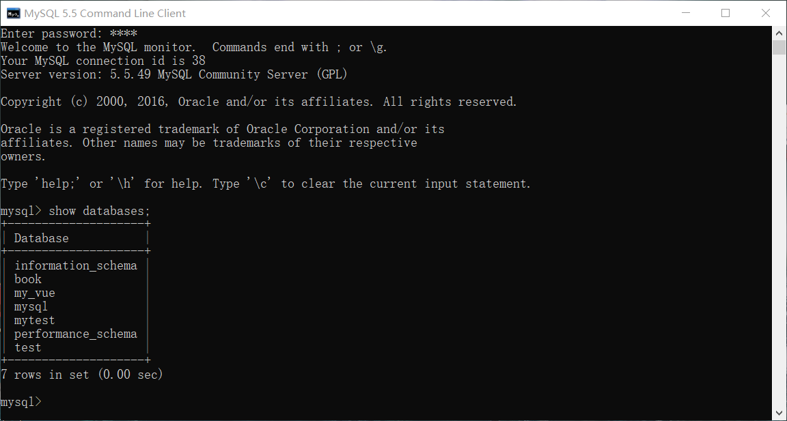
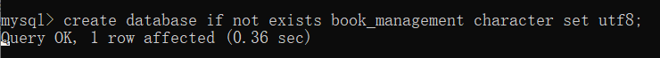
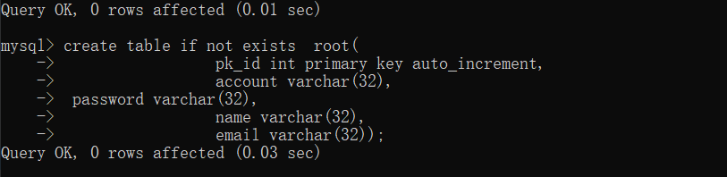
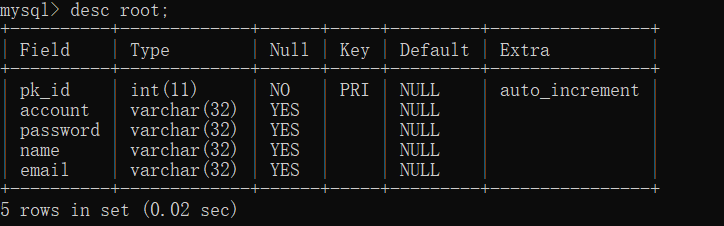
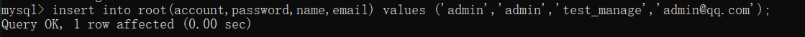

# 第一章节 MySQL
目标掌握MySQL的基本语句操作

熟练使用SQL语句对数据库和表的增删改查操作

* 1.1安装MySQL(根据老师的安装包,一直下一步即可。注意设置编码！)
* 1.2安装成功后，可以把MySQL的环境添加到系统环境中。
* 1.3使用DOS命令窗口，"win"+"R"键打开运行窗口，输入cmd，敲一下回车，就打开了

## 实际操作

1.登入MySQL并查看数据库

`mysql -u root -p回车`

`show databases`


2.创建数据库

```
create database if not exists book_management character set utf8
```



3.选中访问指定的数据库

```
use book_management
```


4.创建root表

```javascript
 create table if not exists  root(
     pk_id int primary key auto_increment,
     account varchar(32),
	 password varchar(32),
     name varchar(32),
     email varchar(32),
    r_create timestamp default now(),
    r_modified timestamp default now()
```



5.查看表结构



6.添加默认数据




### 总结

熟练掌握使用SQL语句增删改查对数据库，表操作。这儿发现问题，在dos命令行窗口添加数据有中文会报错！不能处理！


# 第二章节 三层架构(dao层，service层，servlet层)

## 使用c3p0连接池

1，添加依赖

```
<properties>
    <project.build.sourceEncoding>UTF-8</project.build.sourceEncoding>
    <maven.compiler.source>1.7</maven.compiler.source>
    <maven.compiler.target>1.7</maven.compiler.target>
    <junit.version>4.11</junit.version>
    <junit.version>4.12</junit.version>
    <javax.servlet-api.version>3.1.0</javax.servlet-api.version>
    <fastjson.version>1.2.47</fastjson.version>
    <mysql-connector-java.version>5.1.38</mysql-connector-java.version>
    <commons-dbutils>1.4</commons-dbutils>
    <c3p0.version>0.9.5.5</c3p0.version>
    <commons-fileupload.version>1.3.1</commons-fileupload.version>
    <commons-io.version>2.6</commons-io.version>
    <lombok.version>1.18.8</lombok.version>
  </properties>

  <dependencies>
    <dependency>
      <groupId>org.example</groupId>
      <artifactId>zjw_mvc</artifactId>
      <version>1.0-SNAPSHOT</version>
    </dependency>

    <dependency>
      <groupId>junit</groupId>
      <artifactId>junit</artifactId>
      <version>${junit.version}</version>
      <scope>test</scope>
    </dependency>

    <!--Servlet-->
    <dependency>
      <groupId>javax.servlet</groupId>
      <artifactId>javax.servlet-api</artifactId>
      <version>${javax.servlet-api.version}</version>
      <scope>provided</scope>
    </dependency>

    <!--lombok-->
    <dependency>
      <groupId>org.projectlombok</groupId>
      <artifactId>lombok</artifactId>
      <version>${lombok.version}</version>
    </dependency>

    <!--  fastjson  -->
    <dependency>
      <groupId>com.alibaba</groupId>
      <artifactId>fastjson</artifactId>
      <version>${fastjson.version}</version>
    </dependency>

    <!--mysql驱动-->
    <dependency>
      <groupId>mysql</groupId>
      <artifactId>mysql-connector-java</artifactId>
      <version>${mysql-connector-java.version}</version>
    </dependency>

    <dependency>
      <groupId>commons-dbutils</groupId>
      <artifactId>commons-dbutils</artifactId>
      <version>${commons-dbutils}</version>
    </dependency>

    <!--c3p0连接池-->
    <dependency>
      <groupId>com.mchange</groupId>
      <artifactId>c3p0</artifactId>
      <version>${c3p0.version}</version>
    </dependency>

    <!--beanutils-->
    <dependency>
      <groupId>commons-beanutils</groupId>
      <artifactId>commons-beanutils</artifactId>
      <version>1.9.3</version>
    </dependency>

    <!--文件上传-->
    <dependency>
      <groupId>commons-fileupload</groupId>
      <artifactId>commons-fileupload</artifactId>
      <version>${commons-fileupload.version}</version>
    </dependency>
    <!--IO-->
    <dependency>
      <groupId>commons-io</groupId>
      <artifactId>commons-io</artifactId>
      <version>${commons-io.version}</version>
    </dependency>

  </dependencies>
```


